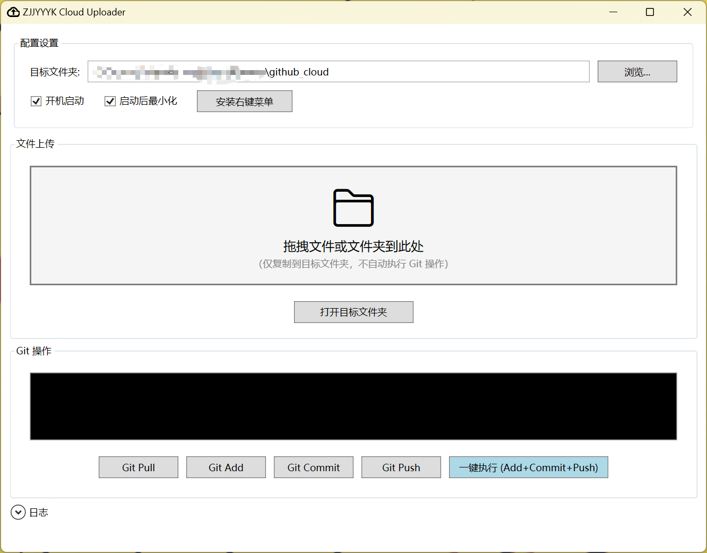

# ZJJYYYK Cloud Uploader

一个简单的 Windows 文件云同步工具。

## 用途

将本地文件快速上传到 Git 远程仓库，支持右键菜单和拖拽两种方式。

### 具体步骤：
1. 创建一个.github.io 类型的 GitHub 仓库，并将其克隆到本地
2. 在本地仓库中创建一个`github_cloud`文件夹作为上传目标
3. 通过右键菜单或拖拽文件到应用窗口，即可将文件复制到`github_cloud`文件夹，并自动执行 Git 操作将文件推送到远程仓库


## 界面



## 运行

```bash
# 发布为单文件可执行程序（需要 .NET 9.0 运行时）
dotnet publish CloudUploader\CloudUploader.csproj -c Release -r win-x64 -p:PublishSingleFile=true

# 运行发布后的程序
.\CloudUploader\bin\Release\net9.0-windows\win-x64\publish\CloudUploader.exe
```

